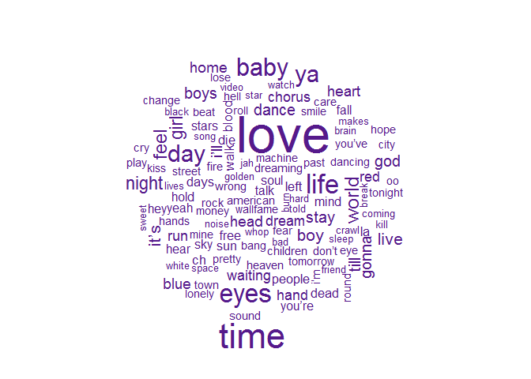
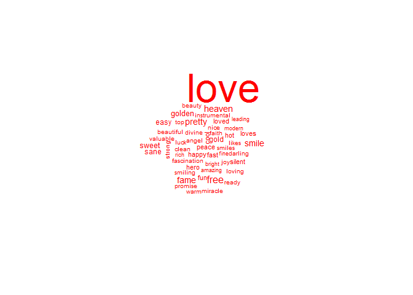
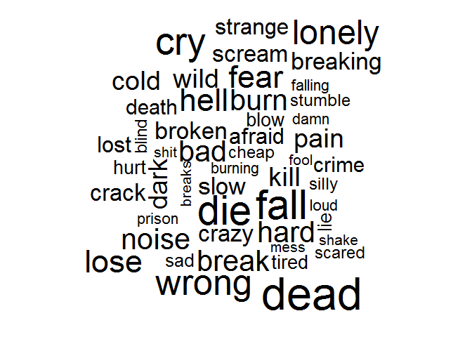

# Tidy Text Mining of David Bowie's Lyrics
Nic Crane  

After hearing about **tidytext** from colleagues who went to the RStudio conference last month, I decided to try it out.  If you want to try out tidy text 
mining for yourself, check out the official website at <http://tidytextmining.com>.

Legendary performer David Bowie would have been 70 earlier this month, and as a 
tribute to his impressive career, I decided to take a look at his lyrics.

First, I used the **rvest** package to scrape all the lyrical content from all
albums on DavidBowie.com.  Only albums from before 2016 which had lyrics present
on this website and weren't re-releases were included (i.e. the eponymous album 
of 1969 was omitted as it was re-released under the title "Space Oddity").


Let's take a look at the structure of the lyrics dataset.

```r
str(bowieLyrics)
```

```
## 'data.frame':	221 obs. of  4 variables:
##  $ lyrics  : chr  " Pushing thru<U+0092> the market square\nSo many mothers sighing,\nNews had just come over,\nWe had five years left to cry in.\nNews g"| __truncated__ " Stone love, she kneels before the grave\nA brave son who gave his life to save the slogan\nThat hovers between the headstone a"| __truncated__ " I<U+0092>m an alligator\nI<U+0092>m a mama-papa comin<U+0092> for you.\nI<U+0092>m the space invader\nI<U+0092>ll be a rock n rollin bitch for you.\nKeep your mo"| __truncated__ " Didn<U+0092>t know what time it was\nThe lights were low,\nI leaned back on my radio,\nSome cat was layin<U+0092> down some rock n roll,\nLo"| __truncated__ ...
##  $ album   : chr  "The Rise And Fall Of Ziggy Stardust And The Spiders From Mars" "The Rise And Fall Of Ziggy Stardust And The Spiders From Mars" "The Rise And Fall Of Ziggy Stardust And The Spiders From Mars" "The Rise And Fall Of Ziggy Stardust And The Spiders From Mars" ...
##  $ albumNum: int  1 1 1 1 1 1 1 1 1 1 ...
##  $ trackNum: int  1 2 3 4 5 6 7 8 9 10 ...
```

The dataset contains a character string for each track, with the lyrics
for the whole song.  It looks good, but it's a bit of a mess, and definitely
needs more work before we can use it for any kind of analysis.

The first job is to tidy up the dataset.  The `unnest_tokens` function in the 
tidytext package makes easy work of this for us.


```r
# tidy data so it has one-token-per-document-per-row format
unnested <- unnest_tokens(bowieLyrics, word, lyrics)
kable(head(unnested, 5))
```

      album                                                            albumNum   trackNum  word    
----  --------------------------------------------------------------  ---------  ---------  --------
1     The Rise And Fall Of Ziggy Stardust And The Spiders From Mars           1          1  pushing 
1.1   The Rise And Fall Of Ziggy Stardust And The Spiders From Mars           1          1  thru    
1.2   The Rise And Fall Of Ziggy Stardust And The Spiders From Mars           1          1  the     
1.3   The Rise And Fall Of Ziggy Stardust And The Spiders From Mars           1          1  market  
1.4   The Rise And Fall Of Ziggy Stardust And The Spiders From Mars           1          1  square  

Looking good, although these lyrics are displayed in the order in which they 
occur.  Let's sort them and take a look at what the most common words are.


```r
# What are the most common words? 
count(unnested, word, sort=TRUE)
```

```
## # A tibble: 4,596 × 2
##     word     n
##    <chr> <int>
## 1    the  1828
## 2    and  1021
## 3    you   972
## 4      i   940
## 5      a   897
## 6     to   788
## 7     in   591
## 8     of   587
## 9     my   501
## 10    me   453
## # ... with 4,586 more rows
```

That's great, but not so interesting.  Let's remove words like 'the' and 'and', 
and take another look. 


```r
data("stop_words")
unnested <- unnested %>% anti_join(stop_words)
```

```
## Joining, by = "word"
```

```r
# Cool, let's try again!
count(unnested, word, sort=TRUE)
```

```
## # A tibble: 4,129 × 2
##     word     n
##    <chr> <int>
## 1   love   221
## 2   time   141
## 3   life   102
## 4   eyes    98
## 5   baby    93
## 6     ya    87
## 7    day    86
## 8  world    69
## 9   feel    62
## 10 night    61
## # ... with 4,119 more rows
```

OK, this is reminding me a lot more of the Bowie songs that I know and love!

I bet this would look better as a word cloud though...


```r
library(wordcloud)

# Some interesting results - one of which is the word "ch" as in "ch ch changes"!
unnested %>%
  anti_join(stop_words) %>%
  count(word) %>%
  with(wordcloud(word, n, max.words = 120, colors="purple4"))
```

<!-- -->

Finally, let's take a quick look at words used to express sentiments in Bowie's lyrics.

The `get_sentiments` function allows us to retrieve sentiment lexicons.  They're in
a tidy format so can easily be joined with our tidy text data.

First, we join the datasets and create a word cloud of only the positive words.


```r
# Sentiment analysis of lyrical content
bing <- get_sentiments("bing")

byEmotion <- unnested %>%
  inner_join(bing)

byEmotion %>%
  filter(sentiment == "positive") %>%
  count(word) %>%
  with(wordcloud(word, n, max.words = 50, colors="red"))
```

<!-- -->

By far the most common positive word in David Bowie's lyrics was 'love'.

Now let's take a look at the negative words.


```r
byEmotion %>%
  filter(sentiment == "negative") %>%
  count(word) %>%
  with(wordcloud(word, n, max.words = 50, colors="black"))
```

<!-- -->

I think I prefer the first word cloud!

This was just a quick look at the tidytext package, but we're a big fan of how
easy it is to quickly analyse text data.  Check out <http://tidytextmining.com/> 
to see what else this package can do!


This blogpost (with code) can also be found on [GitHub](https://github.com/MangoTheCat/blog_bowie_tidytext).
